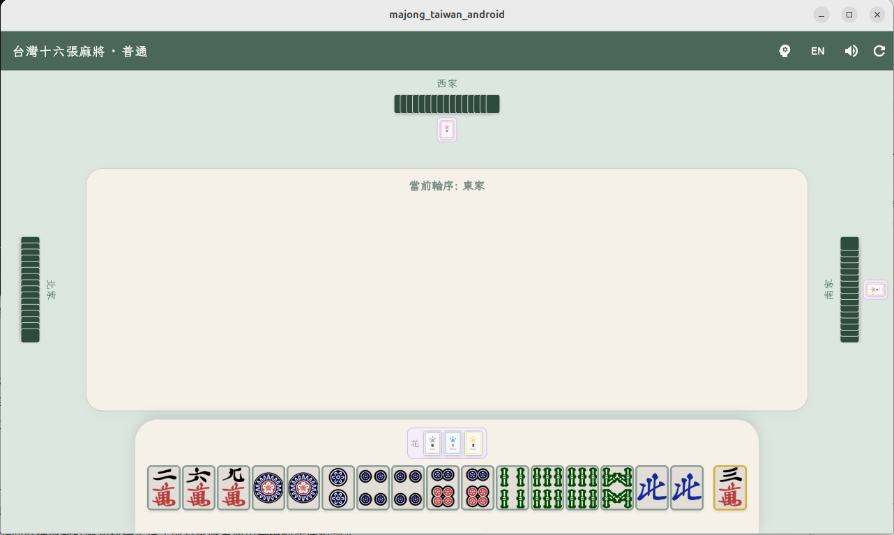
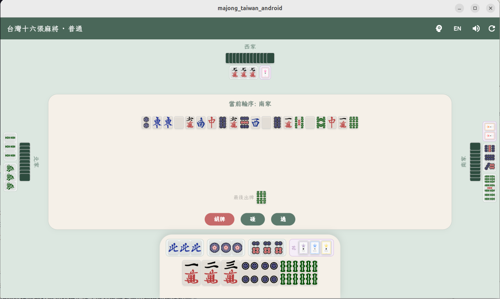
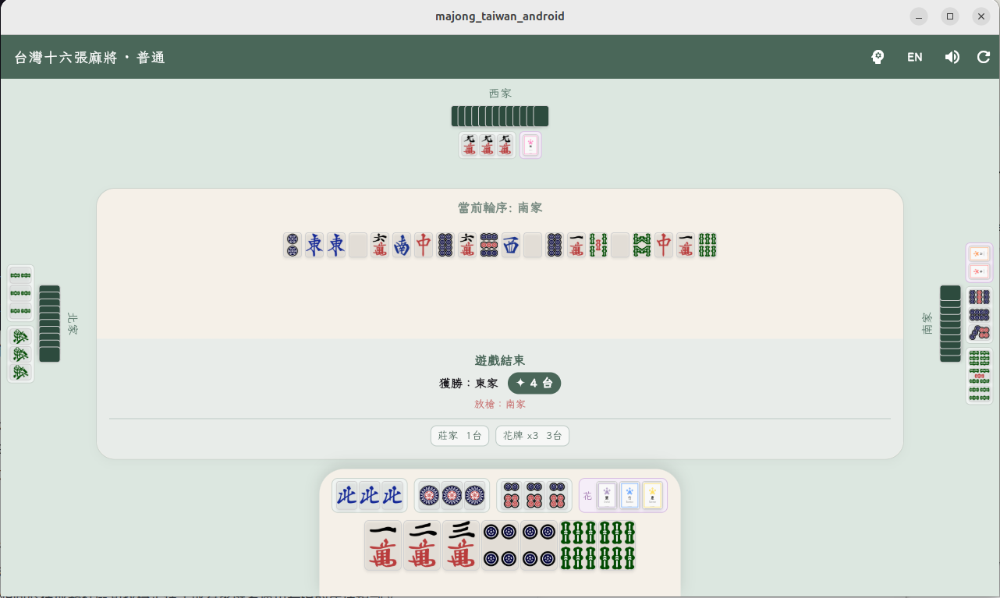
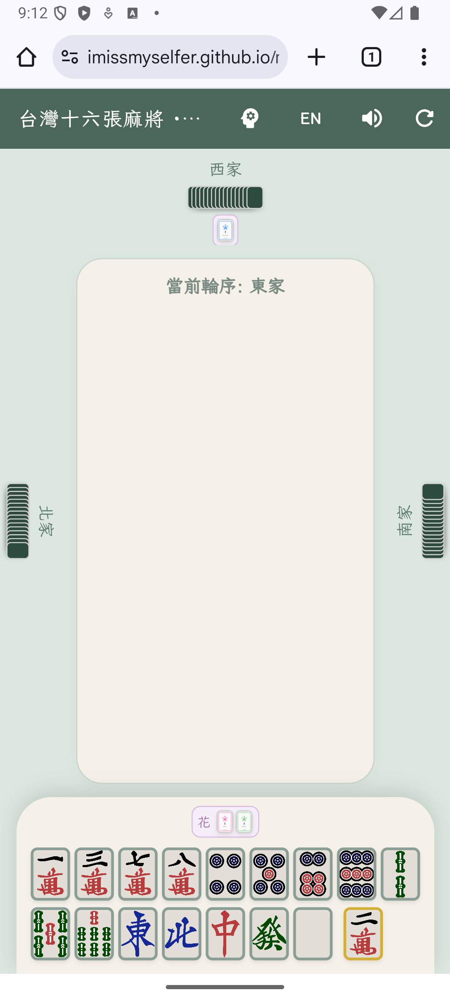
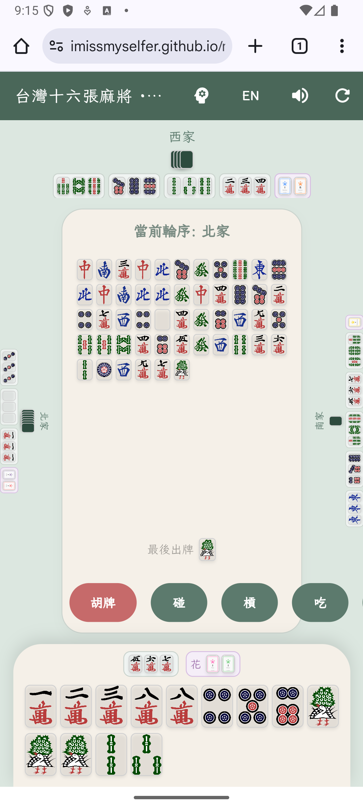
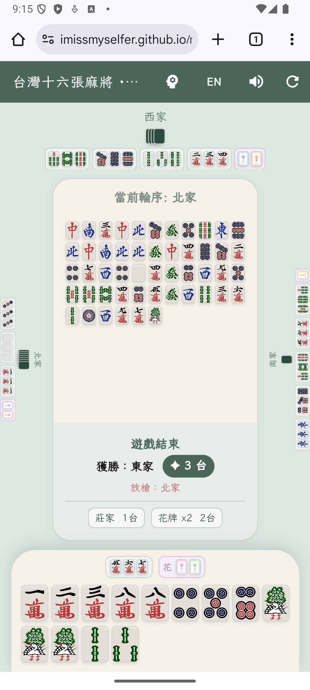

# 🀄 台灣十六張麻將 (Mahjong Taiwan)

[](https://flutter.dev)
[](https://dart.dev)
[](https://flutter.dev)
[](LICENSE)

> 一人對三個 AI，體驗道地台灣十六張麻將。

---

## 🌐 立即遊玩（免安裝）

**任何裝置**開瀏覽器，輸入網址即可遊玩：

👉 **[https://imissmyselfer.github.io/mahjong_taiwan/](https://imissmyselfer.github.io/mahjong_taiwan/)**

手機、平板、電腦皆可，無需下載任何 App。

---

## 📸 截圖

### 桌面版（瀏覽器）

| 遊戲進行中 | 動作選擇 | 結算畫面 |
|:---------:|:-------:|:-------:|
|  |  |  |

### 手機版（行動瀏覽器）

| 遊戲進行中 | 動作選擇 | 結算畫面 |
|:---------:|:-------:|:-------:|
|  |  |  |

---

## ✨ 功能特色

- 🎮 **完整台灣十六張麻將規則**（碰、槓、吃、胡、自摸、槓上花）
- 🌸 **花牌系統**（春夏秋冬 / 梅蘭竹菊，自動補嶺上牌）
- 🤖 **三家 AI 對手**，三檔難度可切換（Easy / Medium / Hard）
- 🧠 **AI 啟發式出牌策略**（保留可利用牌，非完全隨機）
- 📊 **台數計算**（清一色、碰碰胡、三元、四喜、花牌等）
- 🏆 **結算畫面**：顯示放槍者 / 自摸、勝者名稱、台數明細
- 🔊 **音效系統**（吃碰槓胡各自音效，可一鍵關閉）
- 🈚 **雙語介面**（繁體中文 / English 即時切換）
- 📱 **全裝置響應式排版**（手機直向 / 平板 / 桌面自動適配）

---

## 🗂️ 專案結構

本專案為 monorepo，包含兩個套件：

| 目錄 | 說明 |
|------|------|
| `majong_taiwan_android/` | Flutter 遊戲 App（UI、遊戲循環、AI 決策） |
| `majong_taiwan_core/` | 純 Dart 規則引擎（胡牌判斷、台數計算） |

```
mahjong_taiwan/
├── majong_taiwan_android/
│   ├── lib/
│   │   ├── main.dart             # UI、TileWidget、遊戲畫面
│   │   └── mahjong_game.dart     # 遊戲狀態機、AI 決策
│   └── assets/tiles/             # 牌圖 PNG + 花牌 SVG
└── majong_taiwan_core/
    └── lib/src/
        ├── models.dart            # 資料結構（Melt, WinningHand 等）
        ├── win_logic.dart         # 胡牌判斷
        ├── action_validator.dart  # 碰 / 槓 / 吃 合法性
        └── tai_calculator.dart    # 台數計算
```

---

## 🚀 本地開發

```bash
# 1. Clone monorepo
git clone https://github.com/imissmyselfer/mahjong_taiwan.git
cd mahjong_taiwan/majong_taiwan_android

# 2. 安裝依賴
flutter pub get

# 3. 執行
flutter run -d chrome    # Web（推薦）
flutter run -d linux     # Linux 桌面
flutter run              # Android（需連接裝置或啟動模擬器）
```

### Linux 桌面額外依賴

```bash
sudo apt-get install libgtk-3-dev clang cmake ninja-build pkg-config
```

---

## 🏷️ 圖片來源

牌圖使用 [FluffyStuff/riichi-mahjong-tiles](https://github.com/FluffyStuff/riichi-mahjong-tiles) 開源圖集（經 [SyaoranHinata/I.Mahjong](https://github.com/SyaoranHinata/I.Mahjong) 取用）。

---

## 📄 授權

MIT License
